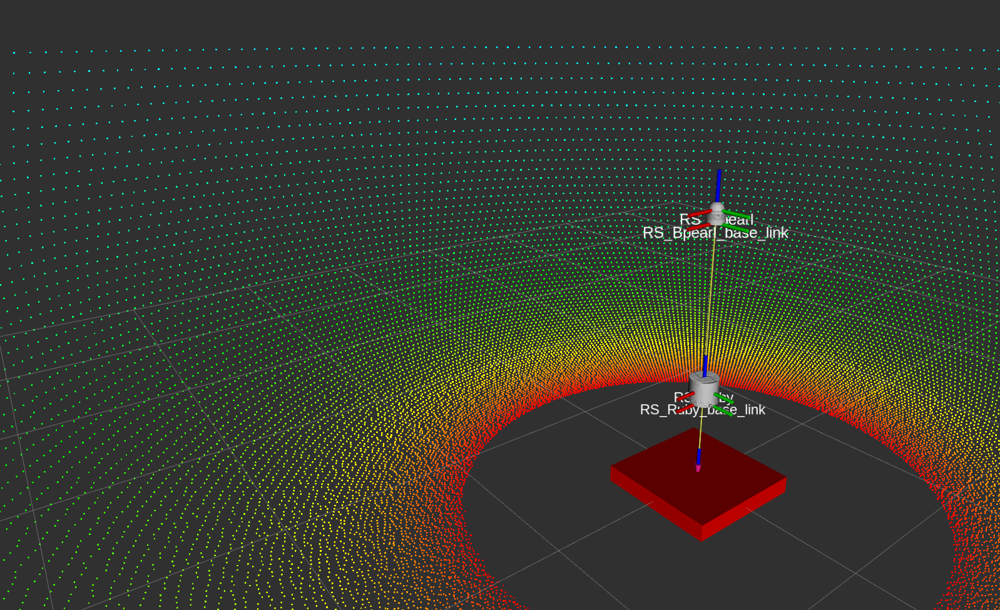

# Velodyne Simulator
URDF description and Gazebo plugins to simulate ITA laser scanners



# Features
* Gazebo plugin based on [gazebo_plugins/gazebo_ros_block_laser](https://github.com/ros-simulation/gazebo_ros_pkgs/blob/kinetic-devel/gazebo_plugins/src/gazebo_ros_block_laser.cpp)
* Publishes PointCloud2 with same structure (x, y, z, intensity, ring, time)
* Simulated Gaussian noise
* GPU acceleration ([with a modern Gazebo build](gazebo_upgrade.md))
* Supported models:
    * [RoboSense RS-Bpearl](robosense_description/urdf/RS_Bpearl.urdf.xacro)
    * [RoboSense RS-Ruby](robosense_description/urdf/RS_Ruby.urdf.xacro)
    * You can easily add more models

# Parameters
* ```*origin``` URDF transform from parent link.
* ```parent``` URDF parent link name. Default ```base_link```
* ```name``` URDF model name. Also used as tf frame_id for PointCloud2 output. Default ```[LiDAR-model]```
* ```topic``` PointCloud2 output topic name. Default ```/[LiDAR-model]_points```
* ```hz``` Update rate in hz. Default ```10```
* ```lasers``` Number of vertical spinning lasers. Default ```RS-Bpearl: 32, RS-Ruby: 128```
* ```samples``` Number of horizontal rotating samples. Default ```RS-Bpearl: 1800, RS-Ruby: 1800```
* ```organize_cloud``` Organize PointCloud2 into 2D array with NaN placeholders, otherwise 1D array and leave out invlaid points. Default ```false```
* ```min_range``` Minimum range value in meters. Default ```RS-Bpearl: 0.1, RS-Ruby: 1```
* ```max_range``` Maximum range value in meters. Default ```RS-Bpearl: 100, RS-Ruby: 250```
* ```noise``` Gausian noise value in meters. Default ```0.008```
* ```vertical_min_angle``` Minimum vertical angle in radians. Default ```RS-Bpearl: 0.04, RS-Ruby: -0.44```
* ```vertical_max_angle``` Maximum vertical angle in radians. Default ```RS-Bpearl: 1.56, RS-Ruby: 0.26```
* ```horinzontal_min_angle``` Minimum horizontal angle in radians. Default ```RS-Bpearl: -PI, RS-Ruby: -PI```
* ```horinzontal_max_angle``` Maximum horizontal angle in radians. Default ```RS-Bpearl:  PI, RS-Ruby:  PI```
* ```gpu``` Use gpu_ray sensor instead of the standard ray sensor. Default ```false```
* ```min_intensity``` The minimum intensity beneath which returns will be clipped.  Can be used to remove low-intensity objects.

# Information
* This package is based on [velodyne_simulator](https://bitbucket.org/DataspeedInc/velodyne_simulator/src/master/)
* The elevated number of lasers of RS-Ruby can be a problem in the simulation. So user can reduce number of points in urdf.

# How to add a sensor
* Copy one of the .urdf.xacro file and edit the properties in the 4th line. Change the visual mesh and adjust the collisions.
* Open [example.rviz](robosense_description/rviz/example.rviz) and add the name, the frames and the topic of your sensor.
* If you want to simulate quickly your new sensor edit [example.urdf.xacro](robosense_description/urdf/example.urdf.xacro) adding you new sensor. Now launch example.launch and check if everything is correct.

# Example Gazebo Robot
```roslaunch robosense_description example.launch```

# Example Gazebo Robot (with GPU)
```roslaunch robosense_description example.launch gpu:=true```

